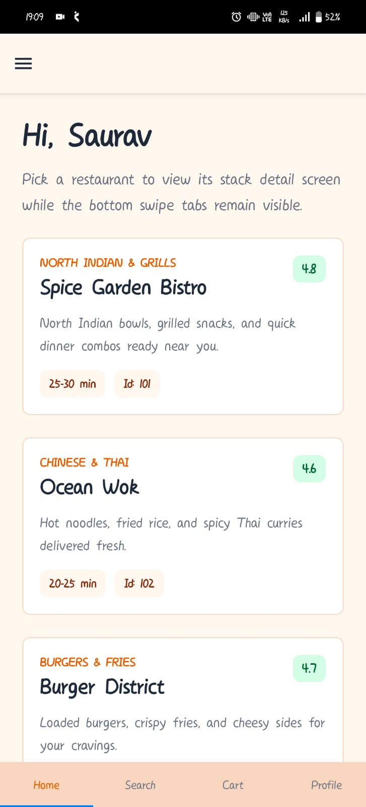
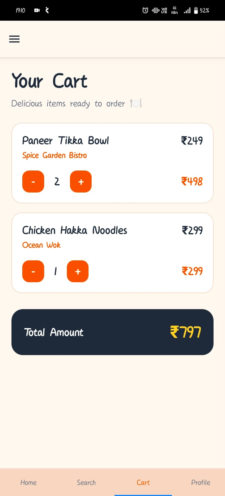
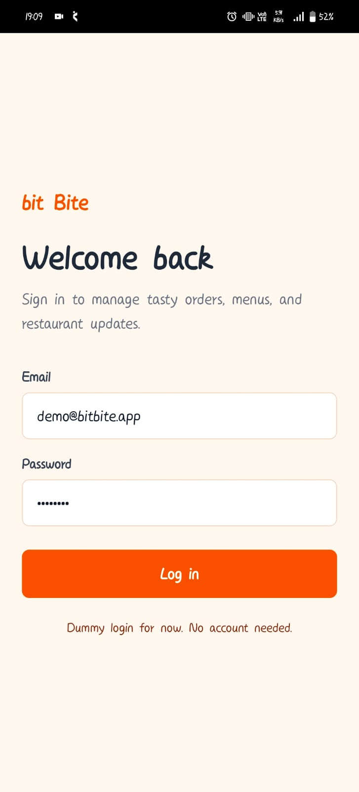

# bit Bite 🍽️

A React Native food ordering application built using Expo and React Navigation.

---

# Project Overview

bit Bite is a restaurant ordering demo application where users can:

- Browse restaurants
- View restaurant details
- Add/remove food items from cart
- Search restaurants and food items
- Manage profile information
- Navigate using Drawer + Tabs + Stack navigators
- Open restaurant pages directly using deep links

---

# Tech Stack

## Frontend

- React Native
- Expo
- TypeScript

## Navigation

- React Navigation
  - Native Stack Navigator
  - Drawer Navigator
  - Material Top Tabs Navigator

## State Management

- React Context API

## Utilities

- react-native-safe-area-context

---

# Features

## Authentication

- Login flow
- Logout functionality
- User profile management

## Restaurant System

- Restaurant listing
- Restaurant detail screen
- Dynamic food item rendering
- Add/remove cart quantity

## Cart System

- Shared cart state using Context API
- Quantity management
- Total amount calculation

## Search

- Search by restaurant name
- Search by food item
- Partial/fuzzy matching

## Profile

- Update profile information
- Keyboard safe UI
- Logout support

## Deep Linking

Supports:

```txt
foodapp://restaurant/101
```

Expo Go deep link:

```txt
exp://<LOCAL_IP>:8082/--/restaurant/101
```

---

# How to Run Locally

## 1. Clone Repository

```bash
git clone <your-repository-url>
cd bit-Bite
```

---

## 2. Install Dependencies

```bash
npm install
```

---

## 3. Start Expo

```bash
npx expo start
```

---

## 4. Run on Mobile

- Install Expo Go
- Scan QR Code
- Ensure laptop and mobile are on same WiFi

---

# Navigation Structure

```txt
Root Stack
│
├── Welcome
├── Login
└── LeftDrawer
     │
     ├── MainTabs
     │    │
     │    ├── Home
     │    ├── Search
     │    ├── Cart
     │    └── Profile
     │
     └── RestaurantDetail
```

---

# Deep Linking Setup

## NavigationContainer Linking Config

```tsx
const linking = {
  prefixes: ["foodapp://"],

  config: {
    screens: {
      LeftDrawer: {
        path: "",
        screens: {
          RestaurantDetail: "restaurant/:restaurantId",
        },
      },
    },
  },
};
```

---

## app.json

```json
{
  "expo": {
    "scheme": "foodapp"
  }
}
```

---

## Test Deep Link

### Expo Go

```txt
exp://192.168.xx.xx:8082/--/restaurant/101
```

### Custom Scheme

```txt
foodapp://restaurant/101
```

---

# Context Providers

## AuthContext

Handles:

- login
- logout
- username update
- password update

## CartContext

Handles:

- addToCart
- removeFromCart
- cart management

---

# UI Theme

Theme inspired by food delivery apps.

## Colors

```txt
Background: #FFF8F1
Primary Accent: #E85D04
Border: #F2D7C2
Text: #1F2937
```

---

# Assumptions Made

- Authentication is mocked locally
- Restaurant data is static
- No backend integration
- Cart persistence not implemented
- Password update is simulated
- Search is client-side only

---

# Future Improvements

- Backend integration
- Persistent auth
- Payment gateway
- Better fuzzy search
- Push notifications
- Wishlist/Favorites
- Dark mode

---

# Screenshots








---

# Demo Video

[Watch Demo](./demo/demo.mp4)

---

# Author

Built using React Native + Expo to practice:

- Nested navigation
- Deep linking
- Context API
- React Native UI development
